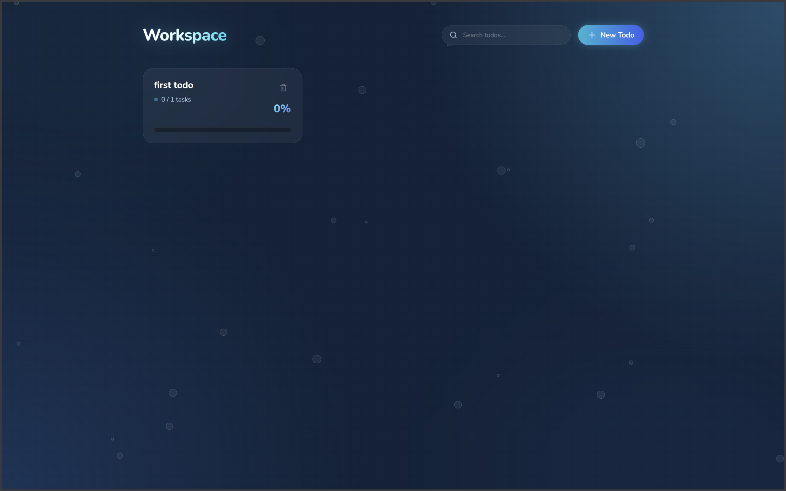
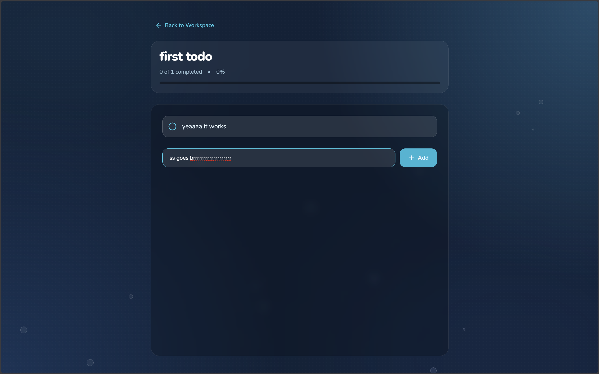
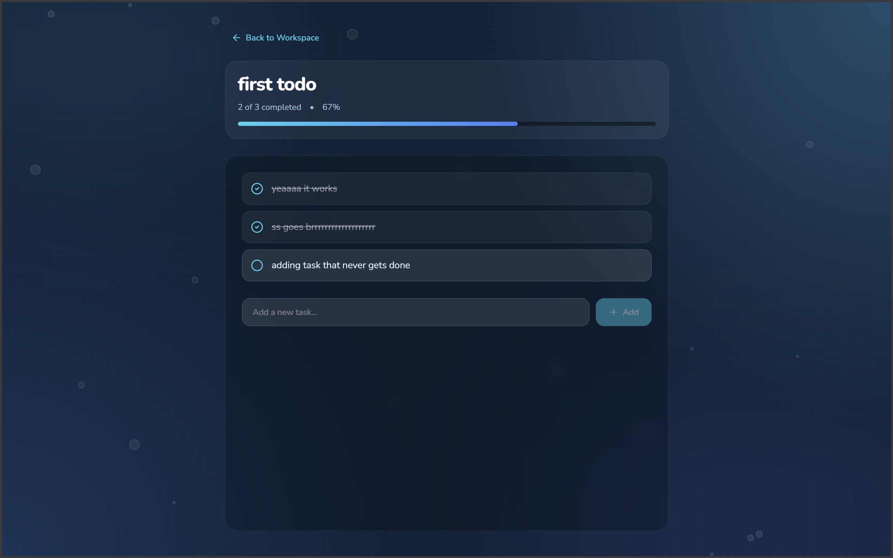
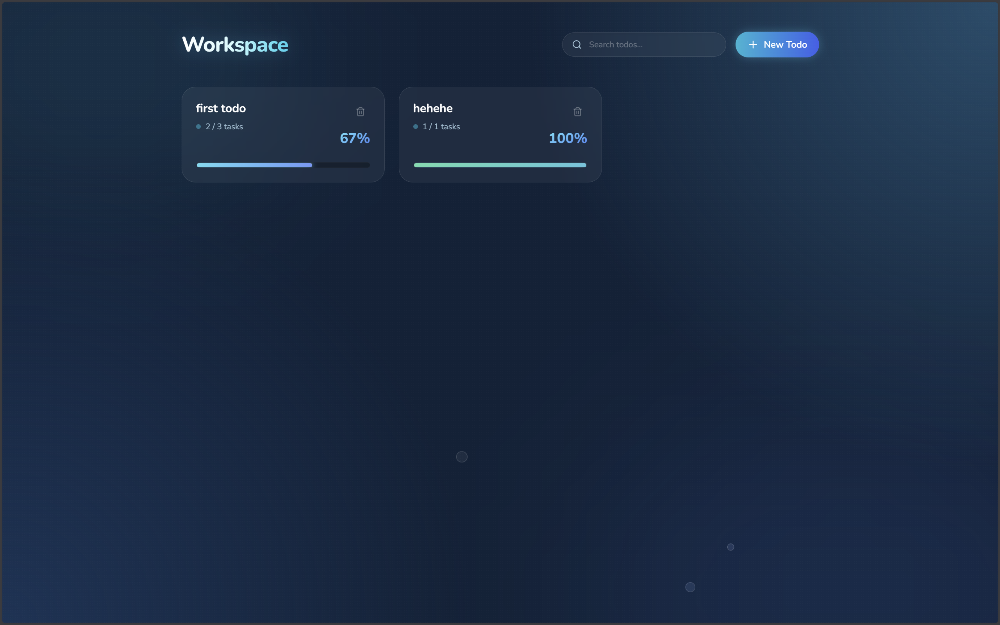

# Todo Fullstack App

A fullstack task manager built using MERN stack.

## 🚀 Features
- Add tasks
- Delete tasks
- Mark complete

## ⚙️ Tech Stack
- React
- Node.js
- Express
- MongoDB

## 📁 Structure
/backend → server  
/frontend → client  

---

## 📸 Preview

### 🏠 Home Page


### ➕ Create Task


### 📋 Completed Tasks


### ✅ Updated Home Page


---

## ▶️ Run locally

### Backend
```bash
cd backend
npm install
npm run dev

### Frontend
cd frontend
npm install
npm run dev
